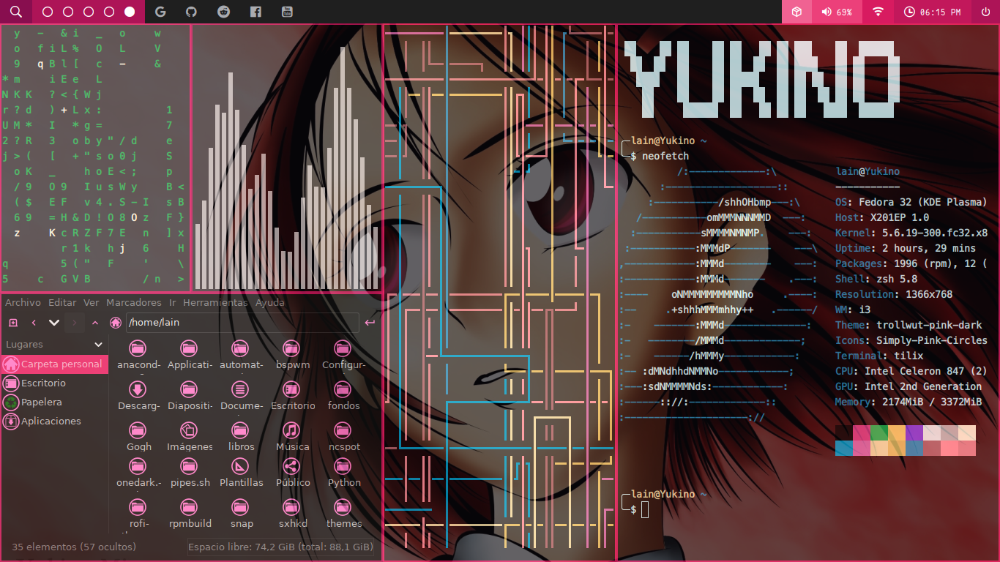

# MyConfiguracion
Mi configuracion de fedora con i3 y polybar.

<p align="center">
  
</p>

## clonamos el repo

```
$ cd ~
$ git clone https://github.com/Gilgamesh06/MyConfiguracion.git
```

## Instalacion de los temas.

<p>
	deberan descomprimir los arhivos yluego moverlos los temas descargados a las capertas pertinentes
</p>

```
$ cd ~/MyConfiguracion/ 
$ tar -xzvf "nombre de losr archivos con extencion"
$ mv ~/MyConfiguracion/themas/thema/trollwut-pink-dark /usr/share/themes/
$ mv ~/MyConfiguracion/themas/iconos/Simply-Pink-Circles /usr/share/icons
$ mv ~/MyConfiguracion/themas/rofi/solarized-darker.rasi /usr/share/rofi/themes
```

## Administrar temas

<p>
	Para ello primero instalarelos: 
</p>

### Debian o derivados 

```
$ sudo apt-get install lxappearance
```

### fedora 

```
$ sudo dnf install lxappearance
```

## Compton

```
$ mv ~/MyConfiguracion/compton  ~/.config
```

## Polybar 


```
$ mv ~/MyConfiguracion/polybar  ~/.config

```

## i3

** Si no a instalado i3 **

### Debian derivados

```
$ sudo apt-get install i3
```

### Fedora

```
$ sudo dnf install i3

```


```
$ cd ~/.i3
$ rm config
$ mv ~/MyConfiguracion/.i3/config  ~/.config

```

**Fondo de pantalla**

*Si desea cambiarlo edite la linea 37 del archivo config de que esta en la carpeta `~/.i3`*